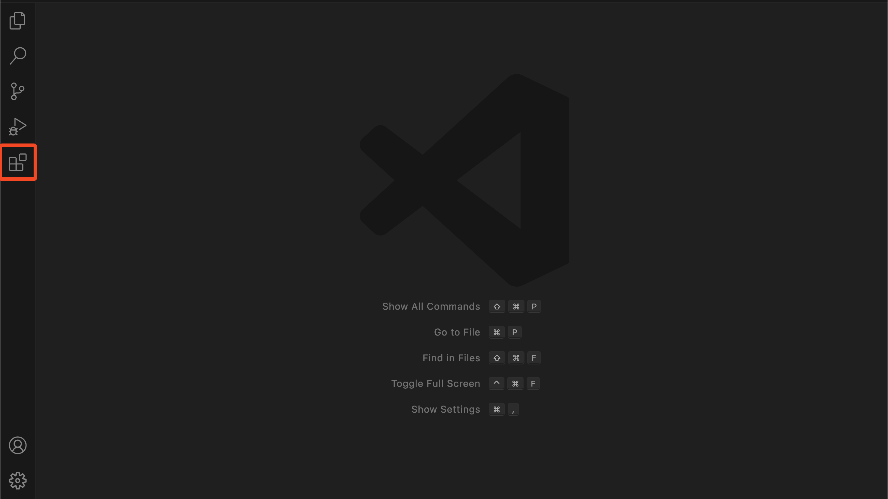
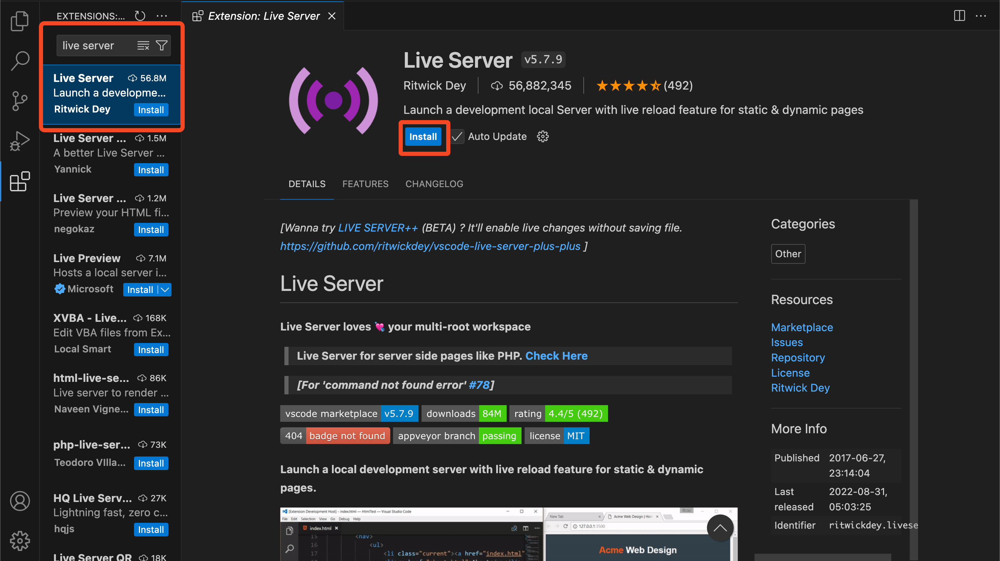
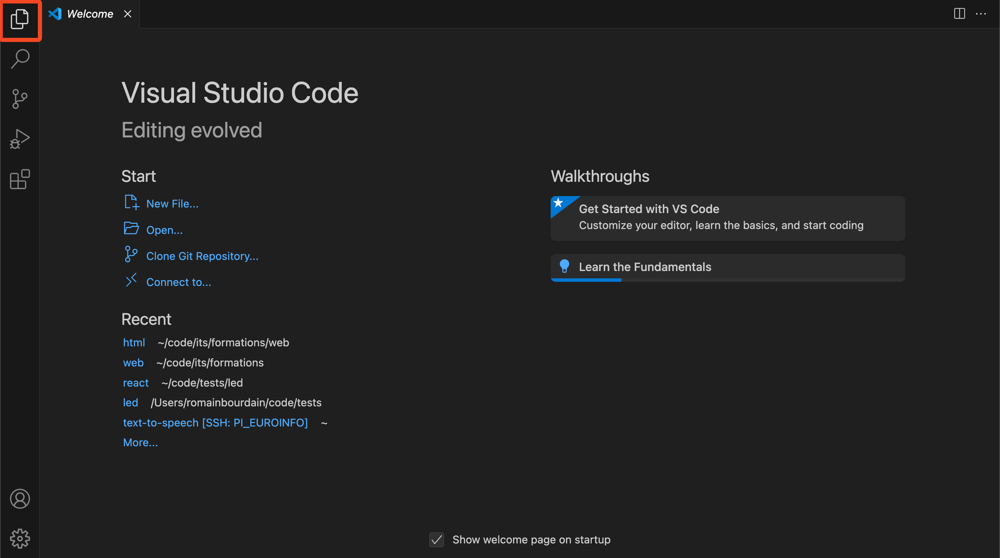
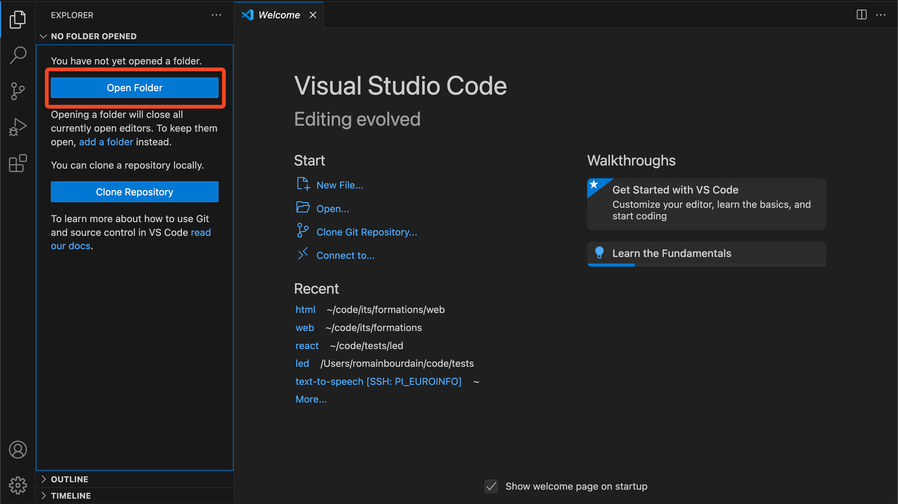
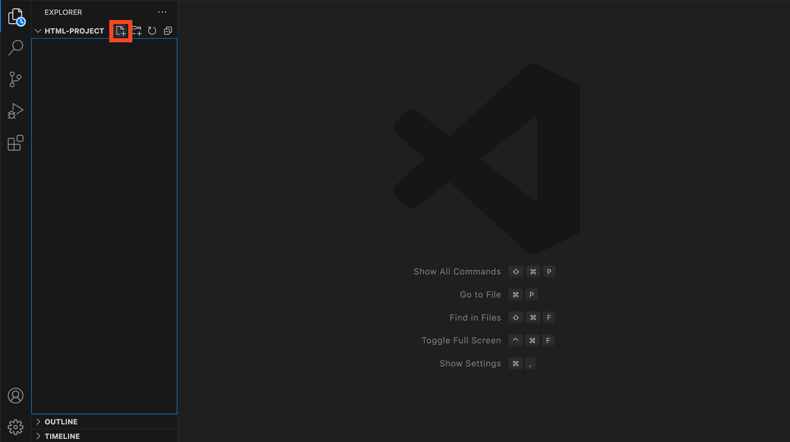
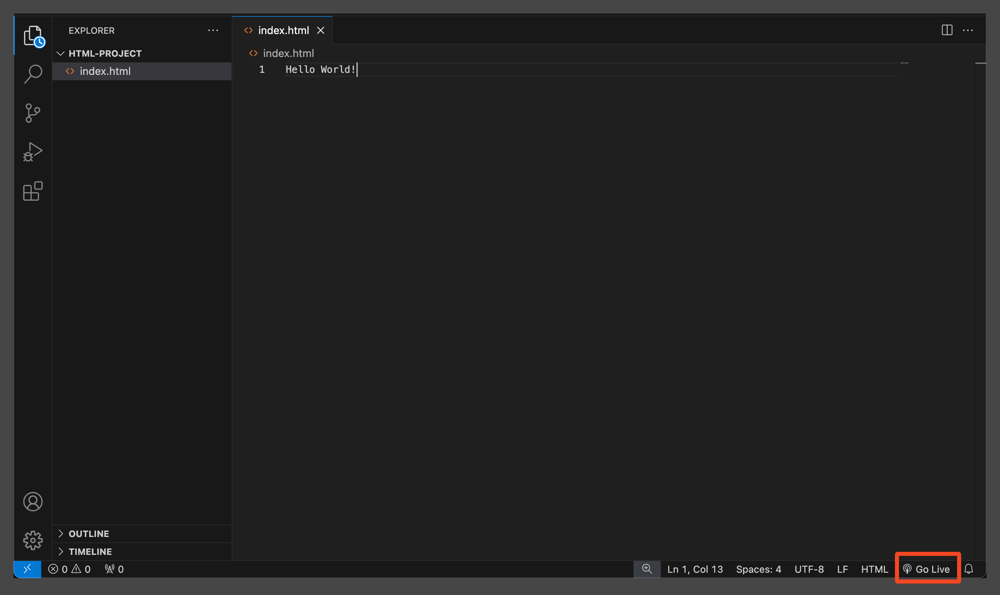
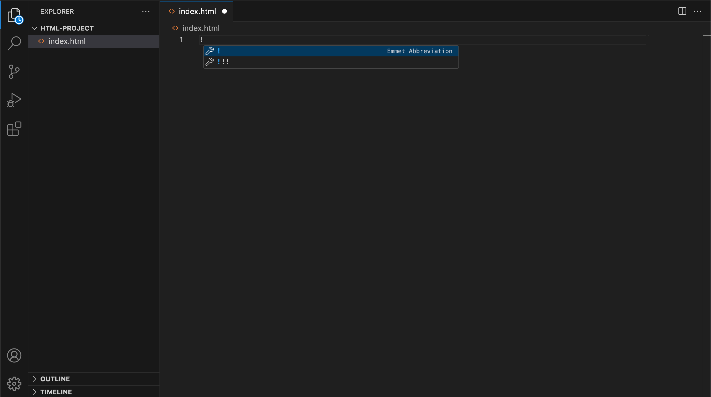

# Formation HTML

Ce dépôt contient les ressources pour apprendre le langage HTML de zéro. L'objectif de cette formation est de reproduire le site web de ... en utilisant les technologies HTML et CSS.

## Configuration

Pour faire du code HTML, rien de plus simple : il suffit d'un éditeur de texte et d'un navigateur web. Vous pouvez utiliser n'importe quel éditeur de texte, mais je vous recommande d'utilise [Visual Studio Code](https://code.visualstudio.com/).

Je vous recommande aussi d'installer l'extension `Live Server` pour Visual Studio Code. Cette extension permet de visualiser le rendu de votre code HTML en temps réel.

Pour l'installer, suivez les étapes suivantes :

- Ouvrez Visual Studio Code
- Allez dans le menu des extensions



- Recherchez "Live Server" dans la barre de recherche et cliquez sur le bouton `Install` pour installer l'extension.



## Créer sa première page HTML

Pour commencer, il va vous falloir créer un dossier pour votre projet. Une fois ceci fait, ouvrez Visual Studio Code.




Une fois que vous avez ouvert votre dossier, vous pouvez créer un nouveau fichier HTML en cliquant sur le bouton `New file...` dans la barre latérale gauche. Donnez un nom à votre fichier en ajoutant l'extension `.html` à la fin. Usuellement, on nomme le fichier `index.html`.



Vous pouvez ensuite écrire du texte dans votre fichier HTML. Par exemple :

```html
Hello world!
```

Pour visualiser le rendu de votre fichier HTML, vous pouvez cliquer sur le bouton `Go Live` en bas à droite de Visual Studio Code.



Votre navigateur web va s'ouvrir et afficher le rendu de votre fichier HTML.

Félicitation ! Vous avez créé votre première page HTML !

## Structure d'une page HTML

Bien évidemment, une page HTML est plus complexe qu'un simple "Hello world". Voici la structure de base d'une page HTML :

```html
<!DOCTYPE html>
<html>
<head>
    <meta charset="UTF-8">
    <title>Document</title>
</head>
<body>
    
</body>
</html>
```

Pour générer cette structure automatiquement, vous pouvez taper `!` dans un fichier HTML et appuyer sur la touche `Tab`.



> [!NOTE]
> Si vous regardez le résultat dans le navigateur, vous ne verrez rien.

## Les balises HTML

HTML est un langage de balisage. Il existe deux types de balises :

- Les balises ouvrantes et fermantes : `<body></body>`
- Les balises auto-fermantes : ``

Certaines balises peuvent prendre des `attributs`. Par exemple, la balise `<html>` peut prendre un attribut `lang` pour définir la langue de la page :

```html
<html lang="fr">
</html>
```

Voici une petite explication de chaque balise utilisée dans la structure de base d'une page HTML

- `<!DOCTYPE html>` : Indique au navigateur que le document est un document HTML5.
- `<html></html>` : Balise racine de la page HTML. C'est à l'intérieur de cette balise que se trouve tout le contenu de la page.

A l'intérieur de la balise `<html>`, le code est divisé en deux parties :

- `<head></head>` : Contient les métadonnées de la page, comme le titre, la description, les styles CSS, etc. Cette partie n'est pas affichée dans le navigateur, mais est utilisée par les moteurs de recherche et par le navigateur pour afficher la page.
- `<body></body>` : Contient le contenu de la page, comme du texte, des images, des liens et tout ce que vous voulez afficher dans le navigateur.

> [!IMPORTANT]
> Ajoutez du texte dans la page HTML et visualisez le rendu dans le navigateur.

## Quelques balises HTML courantes

Cette partie va vous présenter quelques balises HTML couramment utilisées pour structurer une page web. Cette liste n'est pas exhaustive, mais elle vous donnera une idée des balises les plus courantes.

### Les balises de texte

- `<h1></h1>` à `<h6></h6>` : Balises de titre. `<h1>` est le titre le plus important, `<h6>` est le titre le moins important.
- `<p></p>` : Paragraphe de texte.
- `<strong></strong>` : Texte en gras.
- `<em></em>` : Texte en italique.
- `<br />`: Saut de ligne.

> [!NOTE]
> Il est possible d'écrire du texte directement dans la balise `<body>`, mais il est recommandé d'utiliser les balises de texte pour structurer votre contenu.

### Les images

Une image est affichée à l'aide de la balise ``. Cette balise est auto-fermante et prend un attribut `src` pour indiquer l'URL de l'image. On peut aussi ajouter un attribut `alt` pour donner une description de l'image, si celle-ci n'est pas chargée.

```html

```

Le chemin de l'image peut être un URL complet, ou un chemin relatif à la page HTML.

> [!WARNING]
> Il est important de donner un `alt` à chaque image pour des raisons d'accessibilité. Cela permet à la fois d'expliquer ce que fait cette image dans le cas où elle ne serait pas chargée, mais aussi d'aider les moteurs de recherche à comprendre le contenu de l'image.

> [!TIP]
> Il est recommandé de ranger les images dans un dossier `images` à la racine de votre projet pour garder un code source bien organisé.

### Les liens

Les liens sont créés à l'aide de la balise `<a></a>`. Cette balise prend un attribut `href` pour indiquer l'URL de la page vers laquelle le lien pointe.

```html
<a href="https://google.com">Lien vers Google</a>
```

### Les listes

Il est possible de faire des listes en utilisant les balises `<ul></ul>` pour englober la liste et `<li></li>` pour chaque élément de la liste.

```html
<ul>
    <li>Élément 1</li>
    <li>Élément 2</li>
    <li>Élément 3</li>
</ul>
```

> [!TIP]
> Il est possible de créer des listes ordonnées en utilisant la balise `<ol></ol>` à la place de `<ul></ul>`.

### Les balises de structure

- `<div></div>` : Balise de division. Elle est utilisée pour regrouper des éléments HTML ensemble. Nous reviendrons sur cette balise plus tard.
- `<span></span>` : Balise de texte en ligne. Elle est utilisée pour appliquer des styles à une partie du texte.
- `<section></section>` : Balise de section. Elle est utilisée pour regrouper des éléments HTML ensemble.
- `<header></header>` : Balise d'en-tête. Elle est utilisée pour regrouper les éléments d'en-tête de la page.
- `<footer></footer>` : Balise de pied de page. Elle est utilisée pour regrouper les éléments de pied de page de la page.
- `<nav></nav>` : Balise de navigation. Elle est utilisée pour regrouper les éléments de navigation de la page.
- `<aside></aside>` : Balise de contenu à part. Elle est utilisée pour regrouper le contenu qui est à part du contenu principal de la page.
- `<main></main>` : Balise de contenu principal. Elle est utilisée pour regrouper le contenu principal de la page.
- `<article></article>` : Balise d'article. Elle est utilisée pour regrouper les éléments d'un article.

> [!NOTE]
> Il existe beaucoup de balises de structure et il n'est pas utile de toutes les retenir. Il est possible d'avoir un comportement similaire en utilisant des balises génériques comme `<div>` et `<span>`. Cependant, il est recommandé d'utiliser les balises de structure pour aider les moteurs de recherche à comprendre la structure de votre page.

## Les formulaires

Les formulaires sont l'un des éléments les plus importants d'une page web. Ils permettent aux utilisateurs d'envoyer des données au serveur. Voici un exemple simple de formulaire :

```html
<form action="" method="">
    <label for="name">Nom</label>
    <input type="text" id="name" name="name" />

    <label for="email">Email</label>
    <input type="email" id="email" name="email" />

    <label for="message">Message</label>
    <textarea id="message" name="message"></textarea>

    <label for="cgu">Accepter les conditions d'utilisation</label>
    <input type="checkbox" id="cgu" name="cgu" />

    <button type="submit">Envoyer</button>
</form>
```

Oulala, c'est un peu compliqué. Voici une explication des différentes balises utilisées :

- `<form></form>` : Balise de formulaire. Elle englobe tous les éléments du formulaire. Elle prend deux attributs `action` et `method` qui sont sans importance pour l'instant.
- `<label></label>` : Balise de label. Elle est utilisée pour donner un nom à un champ de formulaire. Elle prend un attribut `for` qui doit correspondre à l'`id` du champ de formulaire.
- `<input />` : Balise de champ de formulaire. Elle est utilisée pour créer un champ de formulaire. Elle prend un attribut `type` pour indiquer le type de champ (texte, email, mot de passe, couleur, etc.), un attribut `id` pour l'identifiant du champ et un attribut `name` pour le nom du champ. Nous verrons plus tard à quoi servent ces attributs.
- `<textarea></textarea>` : Balise de champ de texte multiligne. Elle fonctionne de la même manière que la balise `<input />`.

## Gestion des différentes pages

Dans un site web, il est courant d'avoir plusieurs pages. Pour créer une nouvelle page HTML, il suffit de créer un nouveau fichier HTML dans le même dossier que votre fichier `index.html`.

Les pages sont accessibles en changeant l'URL dans le navigateur.

- La page `index.html` est accessible à la racine de votre site, c'est à dire à l'adresse `http://localhost:5500/` si vous utilisez `Live Server`.
- Une autre page `about.html` serait accessible à l'adresse `http://localhost:5500/about.html`.

> [!IMPORTANT]
> Créez une nouvelle page `about.html` et ajoutez un lien vers cette page dans la page `index.html`.

## Mini Projet

Maintenant que vous avez appris les bases du HTML, il est temps de mettre en pratique vos connaissances en créant une page web simple. Vous allez devoir reproduire la page créée à ce [lien](https://romainbourdain.github.io/formation-html/)

Pour vous aider, voici les étapes à suivre :

- Créez un nouveau dossier pour votre projet
- Créez les différents fichier HTML pour votre projet.
- Créez un dossier `images` et ajoutez les images nécessaires pour votre page.
- Ajoutez le contenu des différentes sections de la page en utilisant les balises HTML appropriées.
